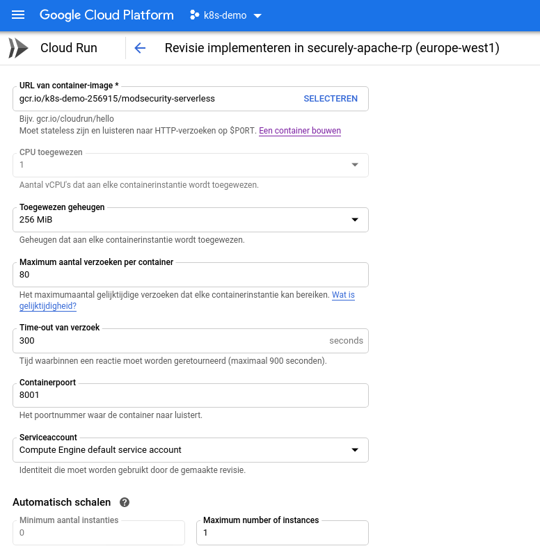
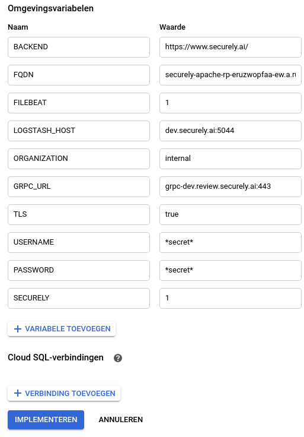

# Serverless ModSecurity with OWASP Core Rule Set

This Docker image inherits from the official OWASP Core Rule Set Docker image (ModSecurity + Core Rule Set) and makes it suitable to run in serverless environments.

The goal is to provide a fully functional CRS in your serverless environment:
* This container can be placed in front of an application.
* The Core Rule Set can be configured using Environment variables.
* It's configuration is managed using your Kibana dashboard.

  
## Configuration

### Backend Services (Upstream)

The Apache ModSecurity engine acts as a reverse proxy to your upstream backend. 
Each backend has a URI, such as *https://example.com/* and a FQDN, such as wwww.example.com. 

Multiple backends are supported as comma-separated entries.

| Name     | Description|
| -------- | ------------------------------------------------------------------- |
| BACKEND | Application backend URI that ModSecurity proxies to, comma separated. (Example: https://www.example.com/ ) |
| FQDN | Domain name that ModSecurity listens to for the given Backend, comma separated. (Example: www.example.com) |

### Logging

| Name     | Description|
| -------- | ------------------------------------------------------------------- |
| (Default) | Logs to /var/log/apache2 |
| STDOUT   | Logs Apache access, error and ModSecurity JSON Audit Log to stdout and stderr |
| FILEBEAT | Sends logs using the Filebeat log shipper. |

#### Filebeat

For this configuration to take effect the FILEBEAT environment variable to be set.

| Name     | Description|
| -------- | ------------------------------------------------------------------- |
| LOGSTASH_HOST | Logstash host name and port number (Example: dev.securely.ai:5044) |
| ORGANIZATION   | Your organization name |

### Centralized ModSecurity configuration

With the [Securely Kibana plugin](https://git.securely.ai/securely/front-end/securely-oss) and the [securely-blocker](https://git.securely.ai/securely/common/blocker) service in this container, configuration is pushed in realtime from your Kibana dashboard.
All documentation is available for review in the specific repositories, below are the settings to quickly get you started.

| Environment variable 	| Default 	| Explanation 	|
|------------------------	|-----------------	|-------------------------------------------------	|
| GRPC_URL 	| 127.0.0.1:50051 	| The server address in the format of host:port 	|
| USERNAME 	| elastic 	| Username for configurator service 	|
| PASSWORD 	| changeme 	| Password for configurator service 	|
| TLS 	| false 	| Connection uses TLS if true, else plain TCP 	|
| TLS_INSECURE 	| false 	| Skips TLS verification if true 	|
| CA_FILE 	|  	| The file containing the CA root cert file 	|

## Configuring ModSecurity

### Engine Configuration

| Name     | Description|
| -------- | ------------------------------------------------------------------- |
| SEC_RULE_ENGINE | This sets ModSecurity in DetectionOnly or blocking (On) mode. (Default: On) | 
| PORT | listening port of apache (Default: 8001) |
| PARANOIA | An integer indicating the blocking paranoia level. Level 1 has very vew false positives and is intended to protect against basic attacks only. Levels two and three require incrementally more tuning, but also provide more protection. (Default: 1)               |
| EXECUTING_PARANOIA | An integer indicating the executing_paranoia_level (Default: 2) |
| ENFORCE_BODYPROC_URLENCODED | A boolean indicating the enforce_bodyproc_urlencoded (Default: 0) |
| ANOMALYIN | An integer indicating the inbound_anomaly_score_threshold (Default: 5) |
| ANOMALYOUT | An integer indicating the outbound_anomaly_score_threshold (Default: 4) |

### Tuning Core Rule Set

| Name     | Description|
| -------- | ------------------------------------------------------------------- |
| ALLOWED_METHODS | A string indicating the allowed_methods (Default: GET HEAD POST OPTIONS) |
| ALLOWED_REQUEST_CONTENT_TYPE | A string indicating the allowed_request_content_type (Default: application/x-www-form-urlencoded\|multipart/form-data\|text/xml\|application/xml\|application/soap+xml\|application/x-amf\|application/json\|application/octet-stream\|application/csp-report\|application/xss-auditor-report\|text/plain) |
| ALLOWED_REQUEST_CONTENT_TYPE_CHARSET | A string indicating the allowed_request_content_type_charset (Default: utf-8\|iso-8859-1\|iso-8859-15\|windows-1252) |
| ALLOWED_HTTP_VERSIONS | A string indicating the allowed_http_versions (Default: HTTP/1.0 HTTP/1.1 HTTP/2 HTTP/2.0) |
| RESTRICTED_EXTENSIONS | A string indicating the restricted_extensions (Default: .asa/ .asax/ .ascx/ .axd/ .backup/ .bak/ .bat/ .cdx/ .cer/ .cfg/ .cmd/ .com/ .config/ .conf/ .cs/ .csproj/ .csr/ .dat/ .db/ .dbf/ .dll/ .dos/ .htr/ .htw/ .ida/ .idc/ .idq/ .inc/ .ini/ .key/ .licx/ .lnk/ .log/ .mdb/ .old/ .pass/ .pdb/ .pol/ .printer/ .pwd/ .resources/ .resx/ .sql/ .sys/ .vb/ .vbs/ .vbproj/ .vsdisco/ .webinfo/ .xsd/ .xsx/) |
| RESTRICTED_HEADERS | A string indicating the restricted_headers (Default: /proxy/ /lock-token/ /content-range/ /translate/ /if/) |
| STATIC_EXTENSIONS | A string indicating the static_extensions (Default: /.jpg/ /.jpeg/ /.png/ /.gif/ /.js/ /.css/ /.ico/ /.svg/ /.webp/) |
| MAX_NUM_ARGS | An integer indicating the max_num_args (Default: unlimited) |
| ARG_NAME_LENGTH | An integer indicating the arg_name_length (Default: unlimited) |
| ARG_LENGTH | An integer indicating the arg_length (Default: unlimited) |
| TOTAL_ARG_LENGTH | An integer indicating the total_arg_length (Default: unlimited) |
| MAX_FILE_SIZE | An integer indicating the max_file_size (Default: unlimited) |
| COMBINED_FILE_SIZES | An integer indicating the combined_file_sizes (Default: unlimited) |

See https://coreruleset.org/ for further information.

### ModSecurity Rule Tuning
  
There are two possible ways to pass ModSecurity tuning rules to the container:

* To map the ModSecurity tuning file(s) via volumes into the container during the run command 
* To copy the ModSecurity tuning file(s) into the created container and then start the container

#### Map ModSecurity tuning file via volume
  
```
docker run -dti \
   --name modsecurity-serverless \
   -p 1.2.3.4:80:8001 \
   -v /path/to/REQUEST-900-EXCLUSION-RULES-BEFORE-CRS.conf:/etc/apache2/modsecurity.d/owasp-crs/REQUEST-900-EXCLUSION-RULES-BEFORE-CRS.conf \
   -v /path/to/RESPONSE-999-EXCLUSION-RULES-AFTER-CRS.conf:/etc/apache2/modsecurity.d/owasp-crs/RESPONSE-999-EXCLUSION-RULES-AFTER-CRS.conf \
   gcr.io/k8s-demo-256915/modsecurity-serverless
```
  
  
#### Copy ModSecurity tuning file into created container
  
This example can be helpful when no volume mounts are possible (some CI pipelines).
  
```
docker create -ti --name modsecurity-serverless \
   -p 1.2.3.4:80:8001 \
   gcr.io/k8s-demo-256915/modsecurity-serverless
  
docker cp /path/to/RESPONSE-999-EXCLUSION-RULES-AFTER-CRS.conf \
   modsecurity-serverless:/etc/apache2/modsecurity.d/owasp-crs/RESPONSE-999-EXCLUSION-RULES-AFTER-CRS.conf
  
docker start modsecurity-serverless
```

# Examples

## Local Docker

These examples use securely.local and example.local. You will have to install these local domains in your local /etc/hosts file.
```bash
visudo /etc/hosts
127.0.0.1       securely.local
127.0.0.1       example.local
```

##### Example logging to stdout

```
docker run -ti --rm \
            --name modsecurity-serverless \
            -e PARANOIA=1 \
            -e ANOMALYIN=5 \
            -e ANOMALYOUT=4 \
            -e BACKEND=https://securely.ai/,https://example.com/ \
            -e FQDN=securely.local,example.local \
            -e STDOUT=1 \
            -e PORT=8001 \
            --expose 8001 \
            --net host \
            gcr.io/k8s-demo-256915/modsecurity-serverless
```

##### Example connecting to Kibana and Logstash
  
```
docker run -ti --rm \
            --name modsecurity-serverless \
            -e PARANOIA=1 \
            -e ANOMALYIN=5 \
            -e ANOMALYOUT=4 \
            -e BACKEND=https://securely.ai/,https://example.com/ \
            -e FQDN=securely.local,example.local \
            -e FILEBEAT=1 \
            -e LOGSTASH_HOST=dev.securely.ai:5044 \
            -e SECURELY=1 \
            -e GRPC_URL=grpc-dev.review.securely.ai:443 \
            -e TLS=true \
            -e USERNAME=elastic \
            -e PASSWORD=changeme \
            -e ORGANIZATION=default \
            -e PORT=8001 \
            --expose 8001 \
            --net host \
            gcr.io/k8s-demo-256915/modsecurity-serverless
```

## GCP Cloud Run (Managed)




# Limitations

## Google Cloud Run (Managed)

#### Filebeat
In the Managed Cloud Run environment, the CPU is severely limited after a request has been processed. 
Filebeat might therefore not have enough CPU available to ship the last log message.

This effect can be reduced by shipping logs to stdout / stderr with the STDOUT environment variable with Logstash parsing from Stackdriver. 

#### Securely-blocker
Due to the severe CPU constraints before a request is processed, the blocks that are loaded in the Apache memory might not be up to date. This leads to false negatives and false positives.
This behavior is partially mitigated with fast apache graceful reloading. 